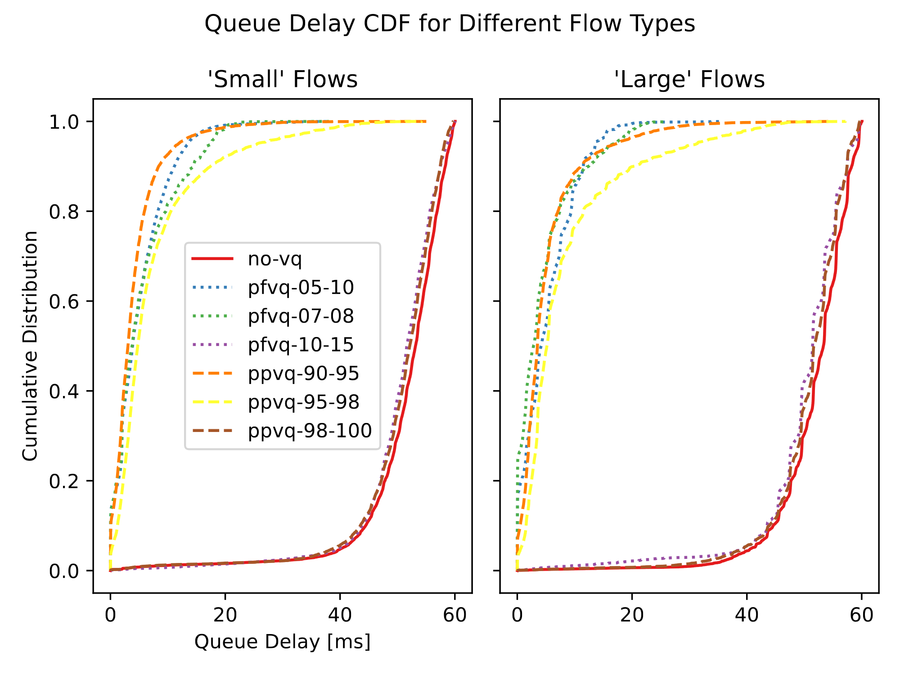
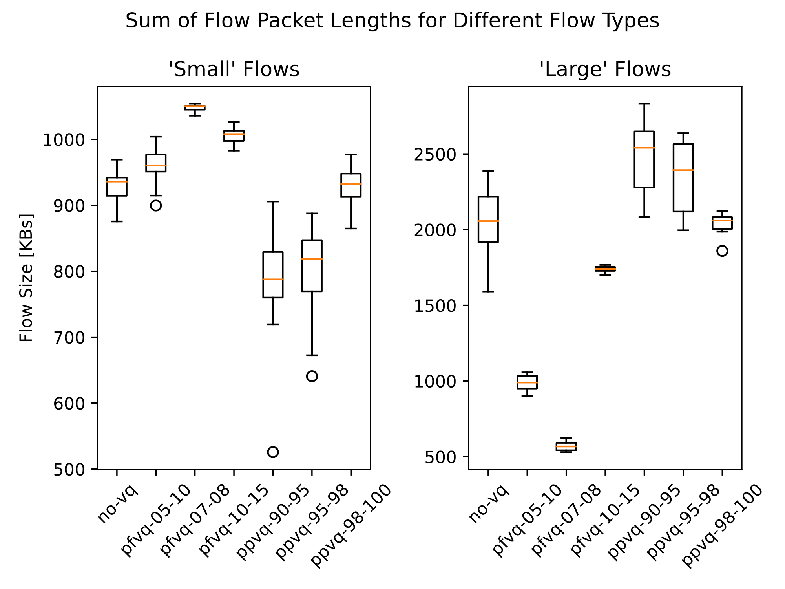

# Per-flow Virtual Queues (Project 9)

The team members, task description, our approach can be found in the [plan](plan.md).

## Project structure

- `docker`: docker setup containing the required dependencies
  - Using a docker container is NOT recommended, just use it as a reference
  - Make sure to enable DCTCP (ECN flag support)
- `switch`: the data plane implementation
  - Switch variants (without VQ, per-port VQ, per-flow VQ) are implemented via preprocessor directives
  - The code most relevant to VQs is in the `logic.p4` file, within `#if`, `#endif`, `#ifdef`, etc. blocks
- `controller`: the control plane implementation
  - Different alpha values (for the VQs) can be set via command line arguments
  - The code most relevant to VQs is in the `_set_virtual_queue_limits` function of `controller.py`
- `network.py`: creates a Mininet network, starts the controller and (optionally) automatically generates traffic
- `measure.sh`: invokes `network.py` multiple times, measuring different alpha values and switch variants
- `plotter`: generates plots from the data gathered by `measure.sh`
  - Matplotlib 3.7.4 is used (because later versions are not supported by Ubuntu 20.04's Python 3.8)
- `Makefile`: entry point, responsible for executing the project

Other folders and files:

- `plan.md`: the implementation plan
- `presentation`: the midterm presentation
- `README.md`: the final report (this document)
- `results`: plots used in the final report

## Running the project

Everything can be run using the `Makefile`. The following commands are available:

- `make clean`: deletes all generated files
- `make cli`: starts the network with an interactive Mininet CLI
- `make measure`: runs `measure.sh` to gather data comparing different switch variants and alpha values
- `make plot`: generates plots from the data gathered by `make measure`

## Results

Measurements have been taken multiple times via `make measure` and the plots generated by `make plot`
have been compared manually to ensure that the results are consistent.
The plots are stored in the [results](results) folder.

The traffic used for the measurements has the following characteristics:

- ECN-enabled DCTCP flows generated by iperf3 for a fixed duration of 20 seconds.
- Two flow types: small (10 flows at 0.4 Mbps) and large (3 flows at 2 Mbps), totalling a target of 10 Mbps (per port).
- The switches have per-port queue rates of 500 pps (6 Mbps) and queue depths of 30 packets (60 ms).

The following switch variants, alpha values have been measured.
The numbers in the name indicate the alpha values for the committed and the peak information rate and burst sizes:
e.g. variant-50-90 means a committed alpha of 50% and a peak alpha of 90%.
ECN marking happens when the committed rate is exceeded and packets are dropped when the peak rate is exceeded.

- No virtual queues, no ECN marking: only the BMv2 queue is active (`no-vq`)
- Per-port virtual queues: each egress port has its own VQ: `ppvq-90-95`, `ppvq-95-98`, `ppvq-98-100`
- Per-flow virtual queues: each egress port-flow pair has its own VQ: `pfvq-05-10`, `pfvq-07-08`, `pfvq-10-15`
  - Each egress port had 13 flows (10 small, 3 large) in total, therefore an alpha of 7.69% yields an even distribution.

### Queue Delay CDF for Different Flow Types

Performed poorly:

- `no-vq`: nothing stopped the switch queue from filling up
- `ppvq-98-100`: the alpha values were too high, the switch queue was able to fill up
- `pfvq-10-15`: each flow got 10% of the total bandwidth, but because there were 13 flows, the total bandwidth
  was exceeded by 30% (13 * 10% = 130%).

The other alpha values all performed well: most packets experienced low delays.

### Sum of Flow Packet Lengths for Different Flow Types

Please keep in mind that each flow was active for 20 seconds, so the flow lengths are proportional to the throughput.

The large flows perform poorly with per-flow virtual queues, as they are limited to alpha% of the total bandwidth,
while they wish to use a lot more.
In these measurements, each large flow requires 33% of the total bandwidth, but only get 10%-20%.

The small flows perform well with per-flow virtual queues, as they are limited to the same alpha%,
resulting in more bandwidth being allocated to them than necessary.
In these measurements, each small flow requires 6.67% of the total bandwidth, but get 10%-20%.
